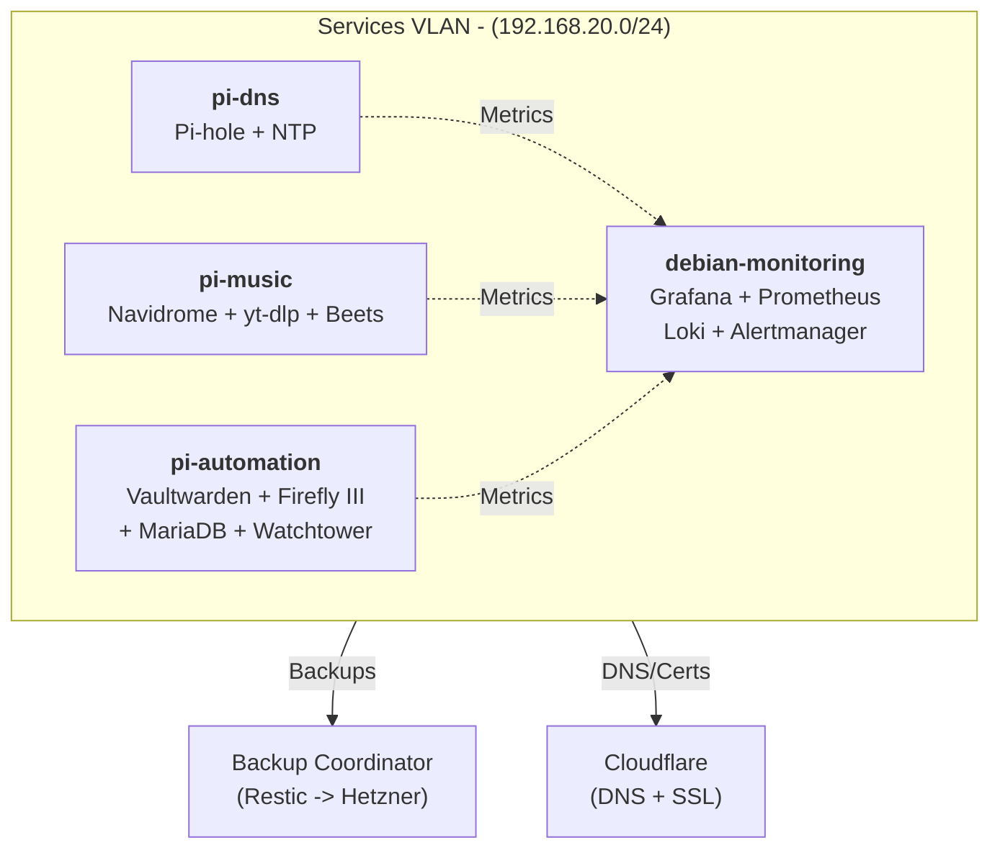

# Infrastructure Automation

[](https://ci.codextechnologies.org/repos/2)

Ansible-based homelab deployment.

**Repository:**
[Codeberg](https://codeberg.org/piotrkrzysztof/cloud) (primary) ·
[GitHub](https://github.com/straightchlorine/cloud) (mirror)

## Architecture



## Quick Start

```bash
just setup          # Create venv, install deps, collections, hooks
just deploy         # Full infrastructure (with confirmation)
just lint           # Ansible-lint + yamllint
just test           # Molecule tests (all roles)
just validate full  # End-to-end infrastructure validation
```

### Deploy Individual Services

```bash
just deploy-service playbooks/music-stack.yml
just deploy-service playbooks/automation-stack.yml
```

Or directly:

```bash
ansible-playbook -i inventory/production/hosts.yml \
  playbooks/site.yml --limit dns --ask-vault-pass
```

## Roles

```
roles/
├── common/              # Docker, packages, network facts, backup
├── dns/                 # Pi-hole DNS + Chrony NTP
├── music-stack/         # Navidrome + yt-dlp + Beets
├── automation/          # Vaultwarden + Firefly III + MariaDB + Watchtower
├── monitoring/          # Grafana + Prometheus + Loki + Alertmanager
├── backup/              # Restic multi-tier backup (standalone + coordinator)
├── backup-system/       # Enterprise backup coordinator
├── firewall/            # UFW configuration
└── prometheus-exporters/ # Node, Docker, Pi-hole, Pi hardware exporters
```

## Configuration

All secrets live in `inventory/production/group_vars/all/vault.yml`. See
[vault.yml.example](inventory/production/group_vars/vault.yml.example).

Host-specific config: `inventory/production/host_vars/{hostname}.yml`
