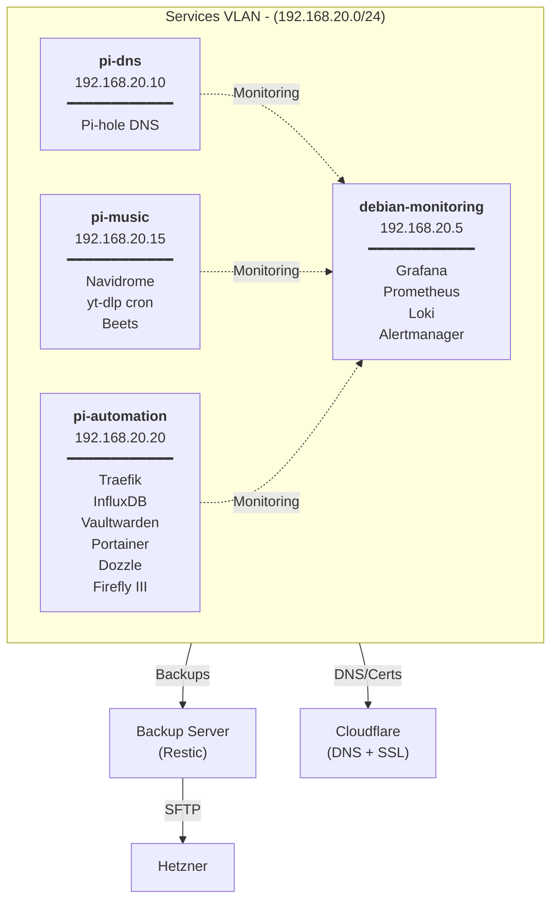

# Infrastructure Automation

Ansible-based infrastructure deployment for Raspberry Pi homelab with enterprise-grade features.

## Architecture and network topology



### Hosts
- **[pi-dns](roles/dns/README.md)** (192.168.20.10): Pi-hole DNS + NTP
- **[pi-music](roles/music-stack/README.md)** (192.168.20.15): Navidrome music streaming
- **[pi-automation](roles/automation/README.md)** (192.168.20.20): Traefik + key services
- **[debian-monitoring](roles/monitoring/README.md)** (192.168.20.5): Grafana + Prometheus + Loki

#### Services by Host

### Network
- **VLAN**: 192.168.20.0/24 (Services)
- **Inventory**: `inventory/production/hosts.yml`

## Quick Deploy

### Prerequisites
```bash
# SSH key must exist
ls ~/.ssh/ansible_controller_key

# Vault file must be configured
ansible-vault edit group_vars/vault.yml
```

### Full Infrastructure
```bash
ansible-playbook -i inventory/production/hosts.yml playbooks/site.yml --ask-vault-pass
```

### Individual Services
```bash
# DNS only
ansible-playbook -i inventory/production/hosts.yml playbooks/site.yml --limit dns --ask-vault-pass

# Music stack only
ansible-playbook -i inventory/production/hosts.yml playbooks/music-stack.yml --ask-vault-pass

# Automation stack only
ansible-playbook -i inventory/production/hosts.yml playbooks/automation-stack.yml --ask-vault-pass

# Backup only
ansible-playbook -i inventory/production/hosts.yml deploy-backup.yml --ask-vault-pass
```

## Advanced Topics

- **[Backup System](docs/backup-system.md)** - Multi-repository strategy, restore testing, compliance
- **[Monitoring Stack](docs/monitoring-stack.md)** - Infrastructure architecture, advanced configuration, optimization
- **[Testing](docs/testing.md)** - Testing requirements and current setup

## Validation

Comprehensive pre and post-deployment validation:

```bash
# Pre-deployment validation
ansible-playbook -i inventory/production/hosts.yml playbooks/site.yml --tags validation --ask-vault-pass

# Infrastructure health check
ansible-playbook -i inventory/production/hosts.yml validate-infrastructure.yml --ask-vault-pass

# Quick mode (for monitoring)
ansible-playbook -i inventory/production/hosts.yml validate-infrastructure.yml -e quick_mode=true --ask-vault-pass
```

## Service Roles

- **[DNS Server](roles/dns/README.md)** - Pi-hole DNS
- **[Music Stack](roles/music-stack/README.md)** - Navidrome + yt-dlp cron + Beets
- **[Automation Stack](roles/automation/README.md)** - Traefik + InfluxDB + Vaultwarden + Portainer
- **[Monitoring Stack](roles/monitoring/README.md)** - Grafana + Prometheus + Loki + Alertmanager
- **[Backup System](roles/backup/README.md)** - Restic with multi-tier repositories and restore testing

## Configuration

All sensitive variables must be set in `inventory/production/group_vars/all/vault.yml` (not in repo).

See [vault.yml.example](inventory/production/group_vars/vault.yml.example) for complete variable reference with:
- **Required variables** - Deployment will fail if missing
- **Optional variables** - Only needed for specific features
- **Validation hints** - Requirements and generation commands

### Host Variables
- **DNS**: `host_vars/pi-dns.yml`
- **Music**: `host_vars/pi-music.yml`
- **Automation**: `host_vars/pi-automation.yml`
- **Monitoring**: `host_vars/debian-monitoring.yml`

## Development

### Role Structure
```
roles/
├── common/            # Shared functionality
├── dns/               # Pi-hole DNS server
├── music-stack/       # Navidrome music server
├── automation/        # Traefik automation services
├── monitoring/        # Grafana/Prometheus/Loki
├── backup/            # Multi-repository backup
└── firewall/          # UFW configuration
```

### Adding New Services
1. Create role-specific variables in `host_vars/`
2. Add service to appropriate Docker compose configuration
3. Update firewall ports in host variables
4. Add backup paths to `backup_directories`
5. Update validation requirements in role's `validate.yml`

### Debugging
```bash
# Dry run
ansible-playbook --check --diff

# Verbose output
ansible-playbook -vvv

# Specific tags
ansible-playbook --tags validation,docker

# Skip validation
ansible-playbook --skip-tags validation
```

## Backup & Recovery

Backup architecture for now actively supports Debian and Arch Linux distributions,
with Gentoo being in plans.

### Differences between distributions

Ther seems to be some disrepancy in the way `restic` works with `SFTP` protocol:

* For **Arch Linux**, just having `RESTIC_SFTP_COMMAND` environment variable defined
is enough to run `restic` commands, such as `restic init` or `restic snapshots`.

* For **Debian 13 (trixie)** this variable doesn't seem to be used/parsed from
the environment. As such, using option parameter is required:
**`restic -o sftp.command=$RESTIC_SFTP_COMMAND [command]`**

### Manual Operations
```bash
# List snapshots
sudo -u backup restic snapshots --password-file /opt/backup/keys/dns-password --repository [repo]

# Restore
sudo -u backup restic restore latest --target /tmp/restore --password-file /opt/backup/keys/[service]-password --repository [repo]
```
